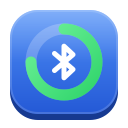
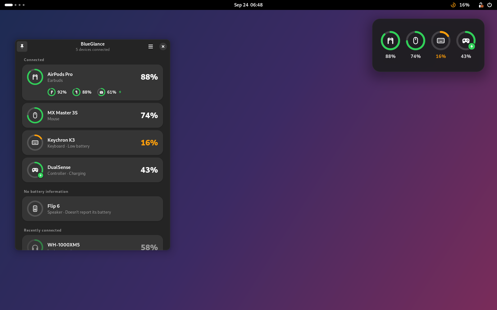
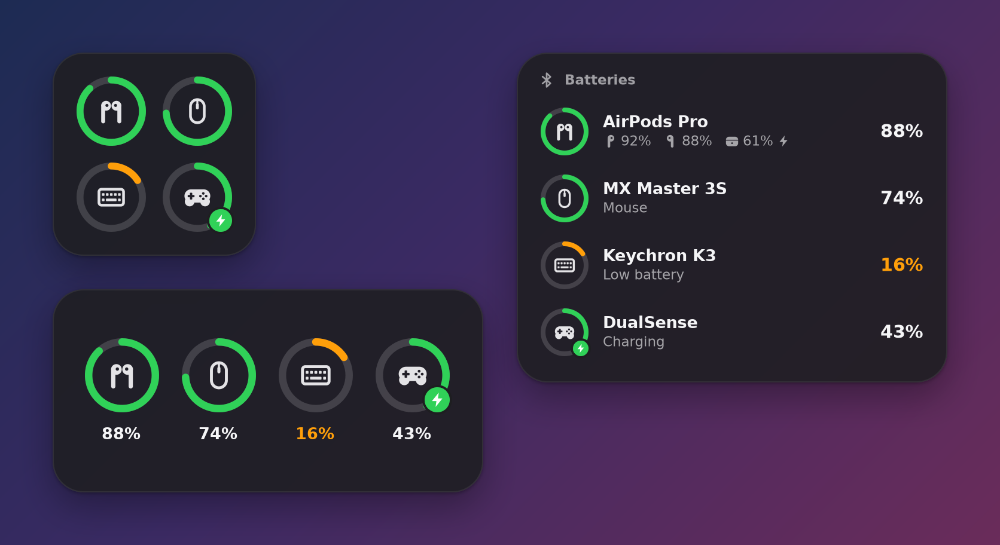
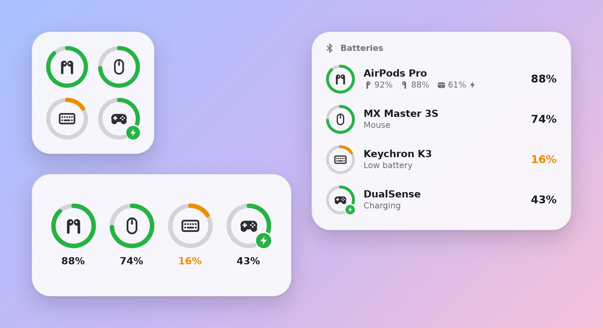
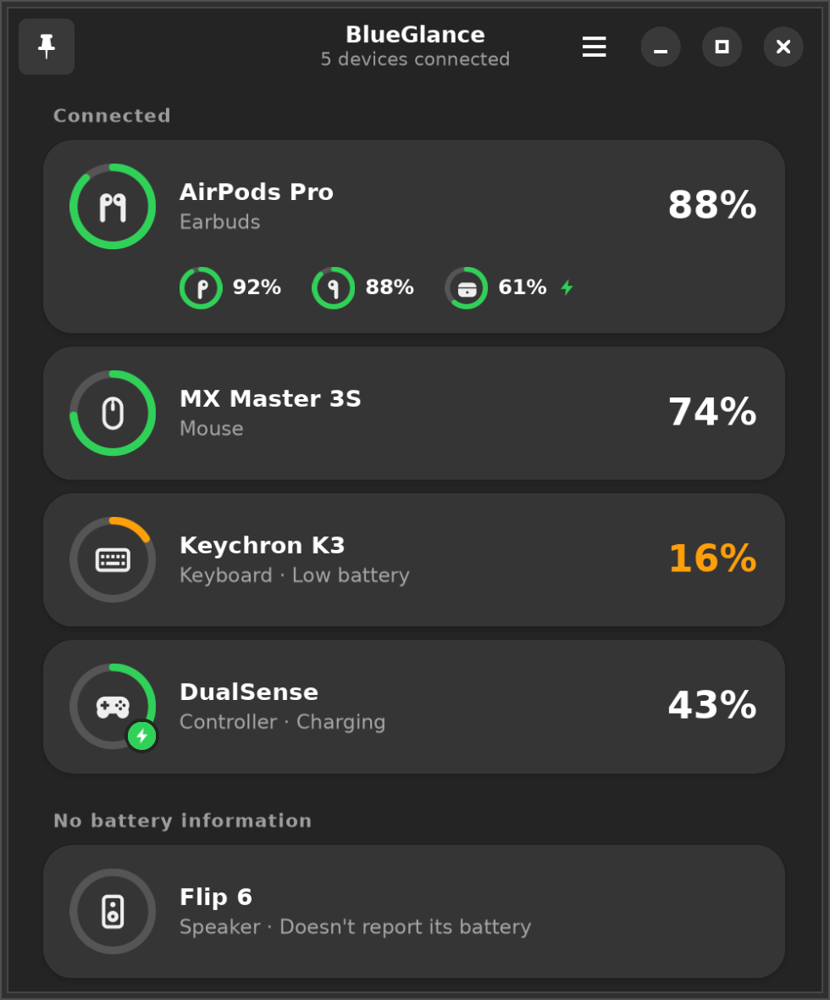
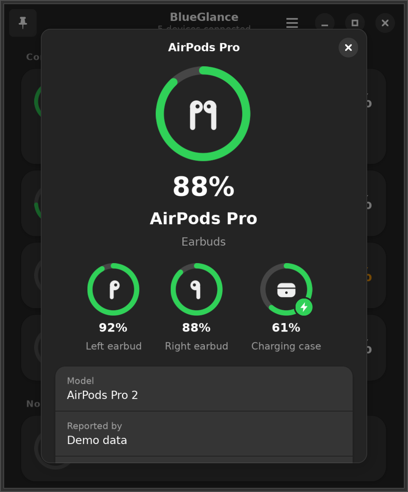
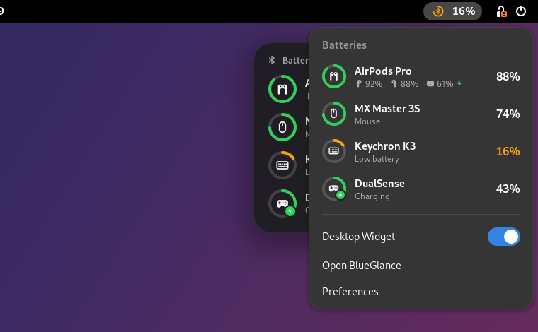
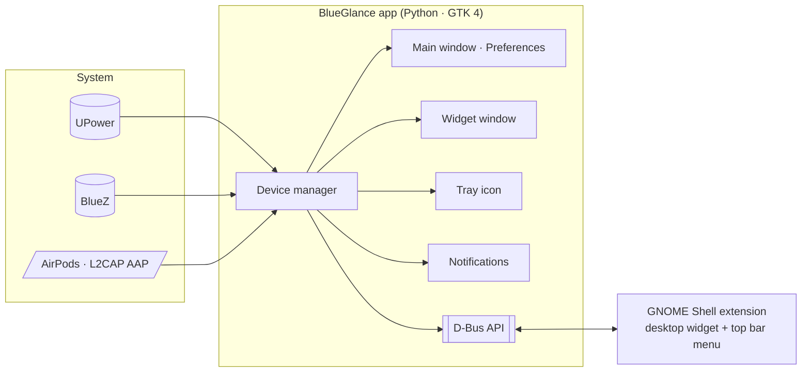

<div align="center">



# BlueGlance

**The battery levels of your Bluetooth devices, at a glance, right on your Linux desktop.**

Mice · keyboards · headphones · AirPods (left, right & case) · game controllers

[Download](https://github.com/rafay-ah/blueglance/releases/latest) ·
[Install](#install) ·
[How it works](#how-it-works) ·
[Troubleshooting](#troubleshooting)



</div>

You shouldn't find out your mouse is dead when it stops moving. BlueGlance keeps an eye on every
battery connected to your computer and shows it the way macOS and iOS do: a small widget pinned to
your desktop, a menu in your top bar or system tray, and a clean app to see the details. It warns
you before anything runs out.

## Features

- **Desktop widget**, inspired by the macOS *Batteries* widget. Three sizes, light and dark, pinned
  below your windows and on every workspace. Drag it anywhere, click it to open the app,
  right-click it for options.
- **AirPods and Beats**: left, right and charging-case levels, read with Apple's own accessory
  protocol, the same way an iPhone does.
- **Everything else too**: Bluetooth mice, keyboards, headsets, speakers, DualSense/Xbox
  controllers, Logitech Unifying/Bolt devices. If UPower or BlueZ knows its battery, BlueGlance
  shows it.
- **Alerts** when a battery is low (you choose the level) or critical, and optionally when it's
  fully charged.
- **Top bar menu** on GNOME, **tray icon** on KDE Plasma, Cinnamon, XFCE, Budgie, MATE and in waybar.
- **Starts with your session**, quietly in the background. One switch turns that off.
- **Remembers** each device's last known level after it disconnects, e.g. your AirPods in their case.
- **Native and light**: GTK 4 + libadwaita, follows your light/dark style, no network access and
  no telemetry.

<table>
  <tr>
    <td></td>
    <td></td>
  </tr>
  <tr>
    <td align="center">Small, medium and large widgets</td>
    <td align="center">…in light style too</td>
  </tr>
</table>

<table>
  <tr>
    <td></td>
    <td></td>
    <td></td>
  </tr>
  <tr>
    <td align="center">All your devices</td>
    <td align="center">AirPods left, right and case</td>
    <td align="center">GNOME top bar menu</td>
  </tr>
</table>

## Install

Grab the files from the [latest release](https://github.com/rafay-ah/blueglance/releases/latest).

### Ubuntu 24.04+, Debian 13+, Linux Mint 22+, Pop!_OS, Zorin, elementary OS

```sh
sudo apt install ./blueglance_0.1.0_all.deb
```

Then start **BlueGlance** from your app grid. From now on it starts by itself when you log in.

> **GNOME / Ubuntu desktop:** log out and back in **once** after installing. GNOME only loads new
> Shell extensions at login, and the extension is what pins the widget to your desktop.

### Any distribution (Fedora, Arch, openSUSE, …)

Install PyGObject, GTK 4 and libadwaita from your distribution, then run the installer from the
source tarball:

```sh
# Fedora:   sudo dnf install python3-gobject gtk4 libadwaita
# Arch:     sudo pacman -S python-gobject python-cairo gtk4 libadwaita
tar xf blueglance-0.1.0.tar.gz && cd blueglance-0.1.0
./install.sh              # just for you, into ~/.local
sudo ./install.sh --system  # or for everyone, into /usr/local
```

`./install.sh --uninstall` removes it again. Arch users can also build
[`packaging/arch/PKGBUILD`](packaging/arch/PKGBUILD).

### Flatpak

```sh
flatpak install --user ./BlueGlance-0.1.0.flatpak
```

The Flatpak works everywhere, but can't install the GNOME Shell extension system-wide. On GNOME,
open Preferences → *GNOME Shell Integration* → **Install**, then log out and back in.

### From source

```sh
git clone https://github.com/rafay-ah/blueglance && cd blueglance
PYTHONPATH=src python3 -m blueglance          # your real devices
PYTHONPATH=src python3 -m blueglance --demo   # sample devices, no Bluetooth needed
```

Or install properly with Meson:
`meson setup build --prefix=/usr -Dpython=/usr/bin/python3 && sudo meson install -C build`.

## Using it

| | |
|---|---|
| **Open the app** | Click the widget, the top bar/tray icon, or launch *BlueGlance* from your apps. |
| **Move the widget** | Drag it. Its position is remembered. |
| **Change the widget** | Right-click it: *Small*, *Medium*, *Large*, *Hide Widget*, *Preferences*. |
| **Pin or unpin** | The 📌 button in the app's header bar (<kbd>Ctrl</kbd>+<kbd>D</kbd>). |
| **Hide a device** | Click it in the app and turn off *Show on Widget and Tray*. |
| **Alerts** | Preferences → *Alerts*: low-battery level (default 20 %) and "fully charged". |
| **Launch at login** | Preferences → *Startup*. On by default. |

Closing the window keeps BlueGlance running for the widget, the tray icon and alerts. Quit it from
the menu (<kbd>Ctrl</kbd>+<kbd>Q</kbd>), or turn off *Run in Background*.

### Where the widget lives

| Desktop | Desktop widget | Top bar / tray |
|---|---|---|
| **GNOME** (Ubuntu, Fedora, Debian…) | Pinned by the bundled GNOME Shell extension (GNOME 45–51) | Extension's top bar menu |
| **KDE Plasma 6**, Sway, Hyprland, COSMIC, niri, labwc, Wayfire | Pinned with [gtk4-layer-shell](https://github.com/wmww/gtk4-layer-shell) if it's installed | Tray icon |
| **X11** desktops: Cinnamon, XFCE, MATE, Budgie, i3… | Pinned below windows on all workspaces | Tray icon |
| Anything else | A floating widget window | Tray icon if your panel supports it |

## How it works



- **UPower** already tracks most peripheral batteries: Bluetooth GATT batteries, kernel HID
  batteries (mice, keyboards, controllers) and wireless receivers.
- **BlueZ** says which devices are connected and what they are, and gives battery levels UPower
  might miss, including headsets whose level PipeWire forwards.
- **AirPods and Beats** report left, right and case levels over Apple's accessory protocol (AAP) on
  an L2CAP channel. BlueGlance opens that channel only while the AirPods are connected to your
  computer, and only reads battery notifications. No root is needed.
- The **GNOME Shell extension** draws the widget and top bar menu inside GNOME Shell (apps can't pin
  windows on GNOME Wayland) from the state the app publishes on the session bus. When it's running,
  the app hides its own widget window and tray icon.

Everything runs locally on D-Bus. BlueGlance never touches the network.

## Troubleshooting

<details>
<summary><b>My headphones are listed under "No battery information"</b></summary>

Most headphones report their battery over the hands-free (HFP) profile. PipeWire reads it and hands
it to BlueZ. Check that:

1. **BlueZ is 5.71 or newer** (`bluetoothctl --version`). On older versions (Ubuntu 22.04 ships
   5.64), BlueZ only accepts the level with `Experimental = true` in `/etc/bluetooth/main.conf`.
   BlueGlance detects this, and shows a banner with a one-click **Fix…** button.
2. **The headset profile is connected.** Some headphones only send the level while HFP is connected,
   not in music-only (A2DP) mode.
3. Some headphones simply don't report a battery level over Bluetooth.
</details>

<details>
<summary><b>AirPods show one level instead of left / right / case</b></summary>

The detailed view needs the AirPods to be connected to *this* computer. Check that
Preferences → *Detailed AirPods Battery* is on. The AirPods only know the case's level while at
least one of them sits in it, so the case can come and go, just like on an iPhone.
</details>

<details>
<summary><b>The widget isn't pinned on GNOME, or shows up as a normal window</b></summary>

The pinned widget comes from the BlueGlance GNOME Shell extension:

- **Just installed?** Log out and back in once.
- Open BlueGlance → Preferences → *GNOME Shell Integration*. It says what's missing and has a button
  to fix it (Enable / Install / Turn On).
- `gnome-extensions info blueglance@rafay-ah.github.io` shows the extension's state.
</details>

<details>
<summary><b>No tray icon</b></summary>

On GNOME the icon comes from the BlueGlance extension (see above). On other desktops your panel
needs StatusNotifierItem support. That's built into KDE Plasma, Cinnamon, Budgie, XFCE (with the
status tray plugin) and waybar.
</details>

<details>
<summary><b>Where are my settings?</b></summary>

`~/.config/blueglance/config.json`, and remembered devices in `~/.local/state/blueglance/devices.json`.
Start with `blueglance --debug` to see detailed logs.
</details>

## Development

```sh
sudo apt install python3-gi python3-gi-cairo gir1.2-gtk-4.0 gir1.2-adw-1 python3-pytest python3-dbusmock
PYTHONPATH=src python3 -m blueglance --demo --debug     # run with sample devices
dbus-run-session -- python3 -m pytest                  # unit + D-Bus integration tests
```

| Path | What |
|---|---|
| `src/blueglance/devices/` | Battery sources: `upower.py`, `bluez.py`, `airpods.py` (AAP), `demo.py`, and `manager.py` which merges them |
| `src/blueglance/ui/` | GTK 4 / libadwaita UI: main window, widget views, rings, preferences |
| `src/blueglance/services/` | Tray icon (StatusNotifierItem), notifications, autostart, D-Bus API, GNOME Shell integration |
| `gnome-extension/` | The GNOME Shell extension (GJS, GNOME 45–51) |
| `scripts/gnome-shell-headless.sh` | Runs a throwaway headless GNOME Shell with the extension and the app. Test the extension without logging out. |
| `scripts/screenshots.py` | Renders the screenshots in `docs/screenshots` |
| `scripts/generate-icons.py` | Generates the symbolic icon set |
| `scripts/build-deb.sh`, `install.sh`, `packaging/` | Debian package, universal installer, Flatpak manifest, PKGBUILD |

To release, bump the version in `meson.build`, `pyproject.toml`, `src/blueglance/__init__.py` and
the metainfo, then run the **Release** workflow (or push a `vX.Y.Z` tag). It builds the `.deb`, the
Flatpak bundle, the extension zip and the source tarball, and publishes a GitHub release.

### Ideas and roadmap

- Publish the extension on extensions.gnome.org (one-click install without logging out) and the app
  on Flathub
- Per-bud battery for Samsung Galaxy Buds, Sony and Pixel Buds
- Battery history charts and time-remaining estimates
- Translations

Contributions are welcome. Please open an issue first for larger changes.

## Credits

- The AirPods battery support is a clean-room implementation based on the public protocol notes of
  [LibrePods](https://github.com/librepods-org/librepods), [CAPod](https://github.com/d4rken-org/capod),
  [MagicPodsCore](https://github.com/steam3d/MagicPodsCore) and the
  [apple-wireshark](https://github.com/pabloaul/apple-wireshark) AACP dissector.
- Built with [GTK](https://gtk.org), [libadwaita](https://gnome.pages.gitlab.gnome.org/libadwaita/),
  [PyGObject](https://pygobject.gnome.org), [UPower](https://upower.freedesktop.org) and
  [BlueZ](https://www.bluez.org).

AirPods and Beats are trademarks of Apple Inc. BlueGlance is not affiliated with Apple. 

## License

[GPL-3.0-or-later](LICENSE) © 2026 Abdul Rafay and contributors.
